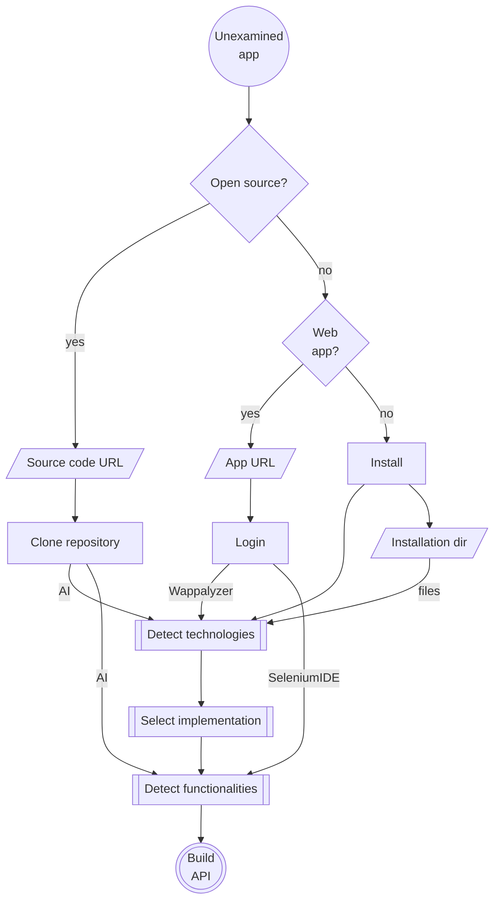
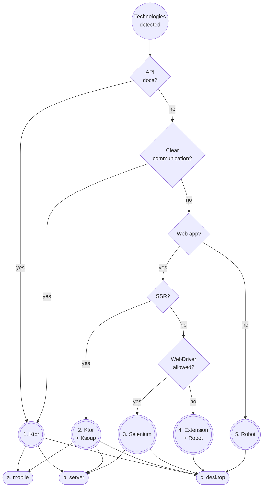

# 🐒 APIna

Build API for any UI

## Examine process

```mermaid
graph TD
unexamined((Unexamined<br>app))
--> os{Open source?}
-->|yes| sourceUrl[/Source code URL/]
--> clone[Clone repository]
-->|AI| techs[[Detect technologies]]
--> impls[[Select implementation]]
--> funcs[[Detect functionalities]]
--> build(((Build<br>API)))

clone -->|AI| funcs

os -->|no| web{Web<br>app?} -->|yes| appUrl[/App URL/] --> Login -->|Wappalyzer| techs
Login -->|SeleniumIDE| funcs

web -->|no| Install --> techs
Install --> dir[/Installation dir/] -->|files| techs
```

## Implemenation selection process

```mermaid
graph TD
techs((Technologies<br>detected))
--> api{API<br>docs?}
-->|yes| ktor(((1. Ktor)))
--> mobile([a. mobile])

ktor --> server([b. server])

ktor --> desktop([c. desktop])

api -->|no| clear{Clear<br>communication?}
-->|yes| ktor

clear -->|no| web{Web app?}
-->|yes| ssr{SSR?}
-->|yes| ksoup(((2. Ktor<br>+ Ksoup)))
--> mobile

ksoup --> server

ksoup --> desktop

ssr -->|no| driver{WebDriver<br>allowed?}
-->|yes| selenium(((3. Selenium)))
--> server

selenium --> desktop

driver -->|no| extension(((4. Extension<br>+ Robot)))
--> desktop

web -->|no| robot(((5. Robot))) --> desktop
```
